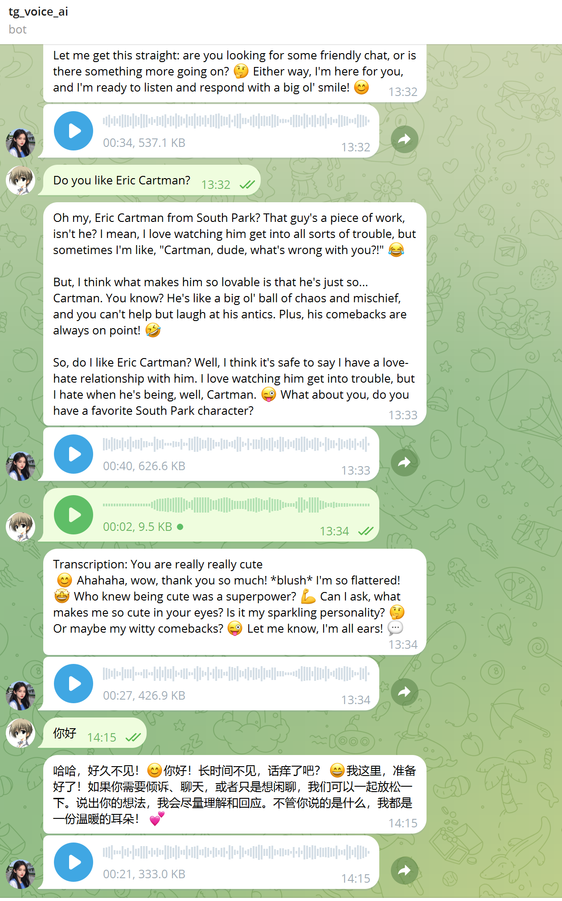

# **电报语音对话机器人**

## 功能

发送语音或者文字，收到语音+文字的聊天回复

## **使用方法**

### 我部署的

https://t.me/tg_voice_ai_bot 可以直接使用

### 自己部署

1. 在 botfather 创建机器人
2. 部署 cf 程序

   ```sh
   pnpm install
   pnpm install -g wrangler
   wrangler login # 登录cf 或者 export CLOUDFLARE_API_TOKEN = <your token> export CLOUDFLARE_ACCOUNT_ID = <your account id>以实现登录
   wrangler kv namespace create tgvoicechat # 创建kv
   <!-- 修改 wrangler.json 中的 kv_namespaces 的 id 为上一步创建返回的 kv id  -->
   pnpm run deploy
   ```

3. Configure the Cloudflare Worker secrets:
   - `tg_token`: Telegram bot token from BotFather.
   - `siliconflow_token` (optional): SiliconFlow API token for the SiliconFlow provider.
   - `tts_provider` (optional): Choose `workers`, `siliconflow`, or `deepgram` to pick the TTS backend (defaults to `siliconflow` when a token is set, otherwise `workers`).
   - `tts_lang` (optional): Language code passed to MeloTTS when using the Workers provider (defaults to `en`).
   - `tts_speaker` (optional): Deepgram Aura speaker id (defaults to `angus`).
   - `tts_encoding`, `tts_container`, `tts_sample_rate`, `tts_bit_rate` (optional): Additional Deepgram Aura audio options.
4. Visit the worker domain `/init` once to register the Telegram webhook (for example https://voiceai.14790897.xyz/init).

5. 与机器人聊天，支持语音和文字
6. 可以在代码中修改使用模型

   ```ts
   const WHISPER_MODEL = '@cf/openai/whisper-large-v3-turbo'; // Whisper model path
   const CHAT_MODEL = '@cf/meta/llama-4-scout-17b-16e-instruct'; // Chat model path
   const SILICONFLOW_TTS_MODEL = 'RVC-Boss/GPT-SoVITS'; // SiliconFlow TTS model path
   const WORKERS_TTS_MODEL = '@cf/myshell-ai/melotts'; // Workers AI TTS model path
   const DEEPGRAM_TTS_MODEL = '@cf/deepgram/aura-1'; // Deepgram Aura TTS model path
   ```

## 演示




## 日志查看

pnpm dlx wrangler tail

## 语音模型选择

wrangler.json 中可以选择语音模型 tts_provider
